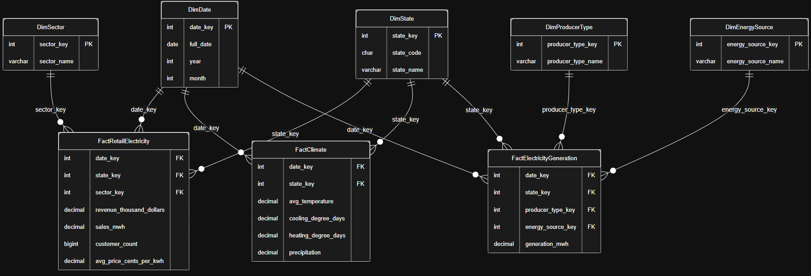
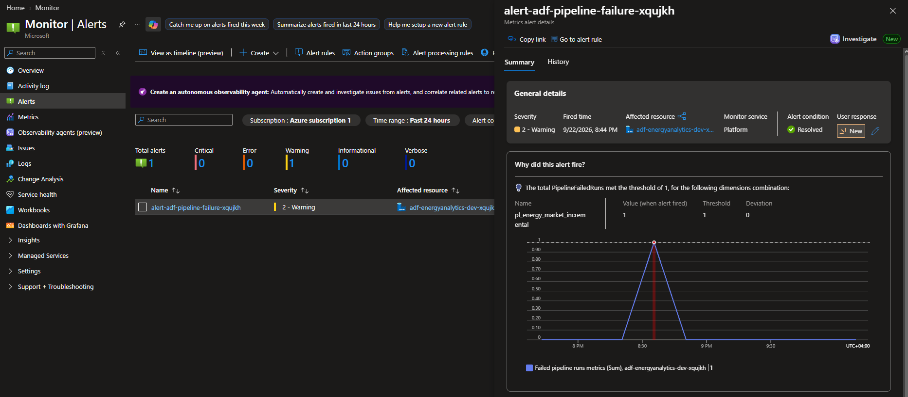
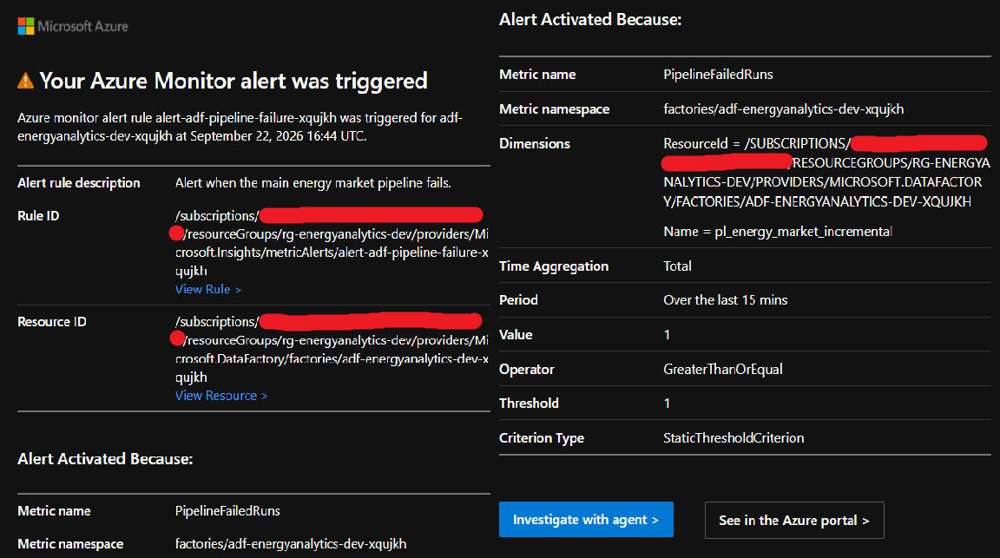
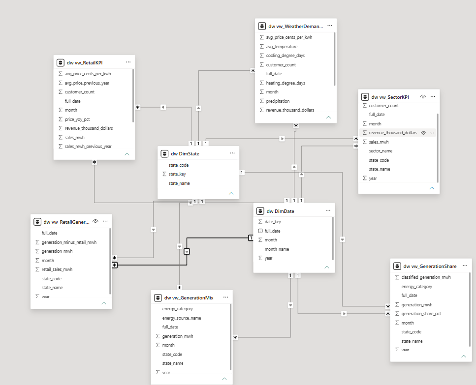

# Energy Market Analytics

Cloud-based batch analytics platform for U.S. electricity market analysis using official EIA and NOAA data.

The solution implements an end-to-end workflow from source files to a Power BI dashboard:

```text
EIA / NOAA
    ↓
ADLS Gen2 /raw
    ↓
Azure Data Factory
    ↓
Azure Functions
    ↓
partitioned Parquet in ADLS /curated
    ↓
incremental Synapse staging
    ↓
data-quality gate
    ↓
incremental dimensional warehouse
    ↓
analytical / KPI views
    ↓
Power BI Desktop
```

## Technology Stack

- Azure Data Lake Storage Gen2
- Azure Data Factory
- Azure Functions
- Azure Key Vault
- Azure Synapse Analytics Dedicated SQL Pool
- Azure Monitor / Action Groups
- Power BI Desktop
- Terraform
- Python / Pandas / PyArrow
- T-SQL
- DAX
- GitHub Actions
- Azure Managed Identities / RBAC

---

# 1. Infrastructure

Infrastructure is provisioned with Terraform.

The deployment creates the following logical resources:

```text
Resource Group
├── Azure Data Factory
├── Azure Function App
│   ├── Function App service plan
│   └── Function runtime/deployment storage
├── ADLS Gen2 data lake
├── Azure Key Vault
├── Azure Synapse Analytics
│   ├── Synapse workspace
│   └── Dedicated SQL Pool
└── Azure Monitor
    ├── Action Group
    └── ADF pipeline-failure metric alert
```

A separate Azure Storage Account is used for the Terraform remote backend.

Resource names use environment-specific/generated suffixes in the actual deployment. The logical placeholders used throughout this README are:

```text
<adf-name>
<function-app-name>
<key-vault-name>
<adls-account>
<synapse-workspace>
<sql-pool>
<terraform-backend-storage>
```

Typical deployment:

```powershell
terraform init
terraform plan
terraform apply
```

The Dedicated SQL Pool is paused when it is not actively required to control compute cost.

The Terraform configuration includes recovery controls appropriate for the reproducible nature of the platform:

- ADLS Gen2 uses **7-day blob/directory soft delete** and **7-day container soft delete** to protect against accidental deletion.
- Blob versioning is not used because the storage account has **Hierarchical Namespace (HNS)** enabled.
- The `/raw` layer is retained as the recoverable source layer. Curated Parquet datasets can be regenerated from raw data through the processing pipelines.
- Synapse Dedicated SQL Pool uses **LRS backup storage** and Azure-managed restore points. Geo-backups are disabled to keep the project cost-efficient.
- A user-defined Synapse restore point can be created before an important shutdown when a known recovery state is required.
- The warehouse can also be reconstructed from ADLS using the version-controlled SQL scripts and ingestion pipelines.
- Terraform and repository-managed processing code allow the infrastructure and data-processing components to be recreated.

---

# 2. Source Data and Raw Layer

Three logical datasets are used.

## 2.1 EIA Retail Electricity Sales

Source: **Monthly Sales to Ultimate Customers by State and Sector**

Workbook:

```text
HS861M_2010-current.xlsx
```

Sheet:

```text
Monthly-States
```

Curated grain:

```text
State × Month × Customer Sector
```

Sectors:

```text
Residential
Commercial
Industrial
Transportation
Total
```

Metrics include revenue, electricity sales, customer count, average electricity price, and data status.

`Total` is preserved for reconciliation and total-level reporting but is never aggregated together with component sectors.

## 2.2 EIA Electricity Generation

Source: **Net Generation by State by Type of Producer by Energy Source**

Curated grain:

```text
State × Month × Producer Type × Energy Source
```

Processing rules:

- preserve valid negative net-generation values;
- exclude national `US-TOTAL` / `US-Total` rows from the state-level dataset;
- preserve producer-type and energy-source total rows for reconciliation;
- never aggregate total rows together with their components.

## 2.3 NOAA Statewide Monthly Climate

Grain:

```text
State × Month
```

Metrics:

- average temperature;
- Cooling Degree Days (CDD);
- Heating Degree Days (HDD);
- precipitation.

The common analytical period starts in 2010.

## 2.4 ADLS Raw Layout

Original source files are preserved under `/raw`:

```text
raw/
├── eia/
│   ├── retail/
│   │   └── HS861M_2010-current.xlsx
│   └── generation/
│       └── generation_monthly.xlsx
└── noaa/
    └── climate/
```

---

# 3. Azure Functions — Curated Layer

Azure Functions perform source-specific transformations with Python/Pandas and write deterministic monthly Parquet partitions.

Endpoints:

```text
POST /api/process-noaa
POST /api/process-eia-retail
POST /api/process-eia-generation
```

Request body:

```json
{
  "min_year": 2010
}
```

Each function returns operational metadata including `max_period`, which is returned by its child ADF pipeline to the master pipeline.

The curated layout is:

```text
curated/
├── climate/
│   └── year=YYYY/
│       └── month=MM/
│           └── data.parquet
└── eia/
    ├── retail/
    │   └── year=YYYY/
    │       └── month=MM/
    │           └── data.parquet
    └── generation/
        └── year=YYYY/
            └── month=MM/
                └── data.parquet
```

Deterministic partition paths make retries safe: rerunning a function rewrites the same monthly objects rather than creating duplicate files.

Validated source volumes:

```text
Climate       10,000 rows
Retail        50,490 rows
Generation   392,595 rows
```

Functions are deployed through GitHub Actions.

---

# 4. Azure Data Factory — Source Orchestration

Azure Data Factory orchestrates the three source-processing paths and the Synapse warehouse load.

## 4.1 ADLS Linked Service

Create:

```text
ls_adls_energyanalytics
```

Purpose:

```text
ADF → project ADLS Gen2
```

Configure the linked service for the deployed `<adls-account>` and verify the connection.


## 4.2 Key Vault Access for Function Calls

ADF uses its system-assigned Managed Identity to read function-specific keys from Azure Key Vault.

Function-key secrets:

```text
function-noaa-key
function-eia-retail-key
function-eia-generation-key
```

The secret values must not be committed to the repository or stored in Terraform.

For each Function endpoint:

1. Open the Function App in Azure Portal.
2. Open the corresponding function.
3. Open **Function Keys**.
4. Copy the required function key value.
5. Open `<key-vault-name>` → **Secrets**.
6. Create the corresponding secret using the names above and paste the Function key as its value.

The resulting mapping is:

| Function endpoint | Key Vault secret |
|---|---|
| `process-noaa` | `function-noaa-key` |
| `process-eia-retail` | `function-eia-retail-key` |
| `process-eia-generation` | `function-eia-generation-key` |

ADF then retrieves these secrets at runtime using its system-assigned Managed Identity.

Each child pipeline first uses a Web activity to retrieve the corresponding secret from Key Vault with:

```text
Authentication: System Assigned Managed Identity
Resource:       https://vault.azure.net
```

The secret value is then supplied to the Function Web activity through the `code` query parameter. Function keys are not hard-coded in the repository or pipeline definition.

## 4.3 Child Processing Pipelines

Create three child pipelines. All three use the same structure:

```text
Get Function Key
        ↓
Process Function
        ↓
Return Max Period
```

The configuration below is common to all three pipelines.

### Step 1 — Get Function Key

Add a **Web** activity that retrieves the corresponding Function key from Azure Key Vault.

| Setting | Value |
|---|---|
| Activity type | Web |
| Method | `GET` |
| Authentication | System Assigned Managed Identity |
| Resource | `https://vault.azure.net` |
| Secure output | `On` |

The URL follows this pattern:

```text
https://<key-vault-name>.vault.azure.net/secrets/<function-key-secret>?api-version=7.4
```

ADF's system-assigned Managed Identity must have permission to read the Key Vault secrets.

### Step 2 — Process Function

Add another **Web** activity with a **Success** dependency on `Get Function Key`.

| Setting | Value |
|---|---|
| Activity type | Web |
| Method | `POST` |
| Authentication | `None` |
| Body | `{"min_year": 2010}` |
| Secure input | `On` |
| Retry | `2` |
| Retry interval | `30 seconds` |

The URL is a dynamic expression following this pattern:

```text
@concat(
    'https://<function-app-name>.azurewebsites.net/api/<function-endpoint>?code=',
    activity('<get-key-activity>').output.value
)
```

Authentication is `None` because the Function key retrieved from Key Vault is supplied through the `code` query parameter.

### Step 3 — Return Max Period

Add a **Set Variable** activity with a **Success** dependency on `Process Function`.

| Setting | Value |
|---|---|
| Activity type | Set Variable |
| Variable type | Pipeline return value |
| Key | `max_period` |
| Type | `Expression` |

The expression follows this pattern:

```text
@activity('<process-activity>').output.max_period
```

The returned value uses `YYYY-MM` format and is consumed by the master pipeline.

### Pipeline-specific Values

Only the following values differ between the three child pipelines:

| | NOAA | EIA Retail | EIA Generation |
|---|---|---|---|
| Pipeline | `pl_process_noaa` | `pl_process_eia_retail` | `pl_process_eia_generation` |
| Key activity | `Get NOAA Function Key` | `Get Retail Function Key` | `Get Generation Function Key` |
| Key Vault secret | `function-noaa-key` | `function-eia-retail-key` | `function-eia-generation-key` |
| Function endpoint | `process-noaa` | `process-eia-retail` | `process-eia-generation` |
| Process activity | `Process NOAA` | `Process EIA Retail` | `Process EIA Generation` |
| Return expression | `@activity('Process NOAA').output.max_period` | `@activity('Process EIA Retail').output.max_period` | `@activity('Process EIA Generation').output.max_period` |

The resulting pipelines are:


---

# 5. SQL Deployment Structure

The final SQL folder contains only the scripts used by the deployed architecture.

```text
sql/
├── 00_setup_external_access.sql
├── 01_create_staging.sql
├── 02_load_staging.sql
├── 03_create_dimensions.sql
├── 04_create_facts.sql
├── 05_load_dimensions.sql
├── 06_incremental_load_retail.sql
├── 07_incremental_load_generation.sql
├── 08_incremental_load_climate.sql
├── 09_create_dq_gate.sql
├── 10_incremental_orchestration.sql
├── 11_grant_adf_permissions.sql
├── 12_create_analytical_views.sql
├── 13_create_kpi_views.sql
├── 14_grant_powerbi_permissions.sql
└── 15_validation.sql
```

### Deployment order

1. External access.
2. Staging tables and incremental staging procedure.
3. Dimension and fact tables.
4. Incremental dimension/fact procedures.
5. Staging DQ gate and warehouse orchestration.
6. ADF database permissions.
7. Analytical and KPI views.
8. Power BI read-only permissions.
9. End-to-end execution and validation.

## 5.1 Running Parameterized SQL Scripts

Most SQL scripts can be executed directly in Synapse Studio. Scripts containing SQLCMD variables must be executed with `sqlcmd` so the values are substituted before execution.

`00_setup_external_access.sql` uses:

```sql
$(ADLS_ACCOUNT)
$(MASTER_KEY_PASSWORD)
```

The master key is created with:

```sql
CREATE MASTER KEY
ENCRYPTION BY PASSWORD = '$(MASTER_KEY_PASSWORD)';
```

### Load Deployment Values

Load the deployed Azure resource names from Terraform:

```powershell
$ADLS_ACCOUNT = terraform -chdir=terraform output -raw adls_account_name
$SYNAPSE = terraform -chdir=terraform output -raw synapse_workspace_name
```

Retrieve the current Azure CLI account for Microsoft Entra authentication:

```powershell
$AZURE_USER = az account show --query user.name -o tsv
```

Set the database master-key password locally:

```powershell
$env:MASTER_KEY_PASSWORD = Read-Host "Master key password"
```

The password is kept outside the repository and is supplied only when the SQL script is executed.

### Execute the Script

From the project root:

```powershell
sqlcmd `
  -S "$SYNAPSE.sql.azuresynapse.net" `
  -d "energydw" `
  -G `
  -U "$AZURE_USER" `
  -I `
  -v ADLS_ACCOUNT="$ADLS_ACCOUNT" MASTER_KEY_PASSWORD="$env:MASTER_KEY_PASSWORD" `
  -i "sql/00_setup_external_access.sql"
```

SQLCMD substitutes:

| SQLCMD variable | Source |
|---|---|
| `$(ADLS_ACCOUNT)` | Terraform output `adls_account_name` |
| `$(MASTER_KEY_PASSWORD)` | Local `MASTER_KEY_PASSWORD` environment variable |

The relevant `sqlcmd` options are:

| Option | Purpose |
|---|---|
| `-S` | Synapse SQL endpoint |
| `-d` | Target Dedicated SQL Pool |
| `-G` | Microsoft Entra authentication |
| `-U` | Entra user |
| `-I` | Enables quoted identifiers |
| `-v` | Supplies values for `$(VARIABLE)` expressions |
| `-i` | SQL script to execute |

Scripts without SQLCMD variables can be executed directly in Synapse Studio.

---

# 6. Synapse Warehouse

## 6.1 External Access

`00_setup_external_access.sql` creates the database master key, Managed Identity database-scoped credential, and curated ADLS external data source.

The Synapse workspace Managed Identity is used for storage access; storage credentials are not embedded in SQL.

## 6.2 Staging

Staging tables:

```text
stg.ClimateMonthly
stg.RetailMonthly
stg.GenerationMonthly
```

Physical design:

```text
ROUND_ROBIN + HEAP
```

`dw.usp_LoadStagingIncremental` owns the staging watermark. For each dataset it:

1. reads `MAX(period)` from staging;
2. uses `2010-01-01` for an empty staging table;
3. targets the current watermark month through the Function-reported `max_period`;
4. deletes only that affected period;
5. reloads only the corresponding monthly Parquet partitions with `COPY INTO`;
6. wraps the delete/reload operation in a transaction.

This intentionally reloads the current watermark month so an incomplete latest month can be completed safely.

## 6.3 Dimensions

```text
dw.DimDate
dw.DimState
dw.DimSector
dw.DimEnergySource
dw.DimProducerType
```

Dimensions use:

```text
DISTRIBUTION = REPLICATE
```

`dw.usp_LoadDimensionsIncremental` inserts only dimension members that do not already exist.

Primary keys are declared `NOT ENFORCED`; uniqueness is validated explicitly.

## 6.4 Dimensional Model

The analytical warehouse follows a dimensional modeling approach with three fact tables sharing conformed dimensions.



The fact grains are:

| Fact | Grain |
|---|---|
| `FactClimate` | State × Month |
| `FactRetailElectricity` | State × Month × Sector |
| `FactElectricityGeneration` | State × Month × Producer Type × Energy Source |

`DimDate` and `DimState` are shared across all three facts. `DimSector` applies to retail electricity, while `DimProducerType` and `DimEnergySource` apply to electricity generation.

The model can therefore be viewed as a collection of related star schemas sharing conformed dimensions (a fact constellation / galaxy schema).

## 6.5 Facts

```text
dw.FactClimate
dw.FactRetailElectricity
dw.FactElectricityGeneration
```

Facts use:

```text
ROUND_ROBIN + CLUSTERED COLUMNSTORE INDEX
```

Hash distribution is not used because these fact tables are relatively small and the workload does not have one consistently dominant join or grouping key that would justify distributing rows by a specific column. The analytical model joins facts to several small replicated dimensions, while cross-fact analysis first aggregates each fact independently to a common grain. `ROUND_ROBIN` therefore keeps the physical design simple and distributes fact rows evenly without introducing a distribution-key dependency. `CLUSTERED COLUMNSTORE INDEX` is used for analytical scan and aggregation workloads.

Facts at different grains are never joined row-for-row. Cross-fact analysis first aggregates to a compatible grain such as `State × Month`.

---

# 7. Data Quality and Incremental Warehouse Loading

`dw.usp_ValidateStaging` is the warehouse DQ gate. It checks:

- non-empty staging datasets;
- required business keys;
- valid period/year/month consistency;
- duplicate source grains.

A failed check raises an error and blocks the warehouse load.

The warehouse orchestration is:

```text
dw.usp_ValidateStaging
    ↓
dw.usp_LoadDimensionsIncremental
    ↓
dw.usp_LoadRetailIncremental
    ↓
dw.usp_LoadGenerationIncremental
    ↓
dw.usp_LoadClimateIncremental
```

Each fact procedure uses the existing maximum `date_key` as its watermark and `NOT EXISTS` at the target fact grain. This makes repeated execution idempotent while allowing the latest month to be completed.

A clean deployment therefore does not require a separate full fact-load script.

End-to-end idempotency was verified by executing the complete master pipeline repeatedly with unchanged source data and confirming unchanged fact counts and no duplicate grains.

---

# 8. Analytical and KPI Views

Core analytical views:

```text
dw.vw_RetailDetail
dw.vw_RetailTotal
dw.vw_GenerationDetail
dw.vw_GenerationTotal
dw.vw_ClimateMonthly
dw.vw_DemandWeather
dw.vw_RetailGeneration
```

Reporting/KPI views:

```text
dw.vw_EnergySourceClassification
dw.vw_GenerationMix
dw.vw_GenerationCategoryMonthly
dw.vw_GenerationShare
dw.vw_RetailKPI
dw.vw_SectorKPI
dw.vw_WeatherDemandKPI
dw.vw_RetailGenerationKPI
```

Important reporting rules:

- Retail detail excludes the `Total` sector.
- Retail total uses only the `Total` sector.
- Generation detail excludes producer/source totals.
- Generation totals use `Total Electric Power Industry` and the `Total` energy source.
- Cross-fact views operate at a compatible `State × Month` grain.
- Aggregated electricity price uses a sales-weighted calculation rather than averaging source price values.
- `generation_minus_retail_mwh` is a comparison metric, not a claim about physical grid imports/exports.

---

# 9. ADF → Synapse Integration and Security

## 9.1 Synapse Linked Service

Create:

```text
ls_synapse_energydw
```

Configure:

```text
Server:
<synapse-workspace>.sql.azuresynapse.net

Database:
<sql-pool>

Authentication:
System-assigned Managed Identity
```


The identity is the system-assigned Managed Identity of `<adf-name>`. Configure Synapse networking to allow the required Azure service access and verify the linked-service connection.

## 9.2 ADF Database Permissions

ADF connects to `<sql-pool>` through `ls_synapse_energydw` using its system-assigned Managed Identity.

The ADF database principal receives only the permissions required by the implemented stored procedures:

```text
EXECUTE on dw
SELECT / INSERT / DELETE on stg
SELECT / INSERT on dw
ADMINISTER DATABASE BULK OPERATIONS
```

ADF does not require `db_owner`, `CONTROL`, or warehouse `UPDATE`/`DELETE`.

## 9.3 Master Incremental Pipeline

The master pipeline is:

```text
Process NOAA ─────────────┐
Process EIA Retail ───────┼─→ Load Staging Incremental
Process EIA Generation ───┘              ↓
                              Load Warehouse Incremental
```


All child `Execute Pipeline` activities use **Wait on completion** so their `pipelineReturnValue.max_period` values are available to the staging procedure.

---

# 10. Monitoring

Terraform provisions:

```text
Azure Monitor metric alert
    ↓
ADF PipelineFailedRuns
    ↓
pl_energy_market_incremental
    ↓
Action Group
    ↓
Email notification
```

The monitoring path was validated with a controlled master-pipeline failure. The failed run appeared in ADF metrics and the configured Action Group delivered the failure email.




---

# 11. Power BI Read-only Access

The Synapse administrator is used only to provision the reporting login/user.

Create the server login in `master`:

```sql
CREATE LOGIN powerbi_reader
WITH PASSWORD = '<STRONG_PASSWORD>';
```

Then create the database user in `<sql-pool>`:

```sql
CREATE USER powerbi_reader
FROM LOGIN powerbi_reader;
```

`14_grant_powerbi_permissions.sql` grants `SELECT` only to the dimensions and reporting views required by Power BI.

The report connects using:

```text
Server:         <synapse-workspace>.sql.azuresynapse.net
Database:       <sql-pool>
Authentication: Database / SQL authentication
User:           powerbi_reader
```

The reporting password is not stored in the repository.

---

# 12. Power BI Connection and Model

Connect Power BI Desktop to:

```text
Server:
<synapse-workspace>.sql.azuresynapse.net

Database:
<sql-pool>

Authentication:
Database / SQL authentication

User:
powerbi_reader
```

Import:

```text
dw.DimDate
dw.DimState
dw.vw_RetailKPI
dw.vw_SectorKPI
dw.vw_GenerationMix
dw.vw_GenerationShare
dw.vw_WeatherDemandKPI
dw.vw_RetailGenerationKPI
```

For each of the six reporting views create:

```text
DimState[state_code]
1 → *

DimDate[full_date]
1 → *
```

Relationship settings:

```text
Active: Yes
Cross-filter direction: Single
```

No direct view-to-view relationships are required.

Total relationships:

```text
12
```



---

# 13. Power BI Measures

## Retail

```DAX
Total Retail Sales =
SUM('dw vw_RetailKPI'[sales_mwh])
```

```DAX
Total Revenue =
SUM('dw vw_RetailKPI'[revenue_thousand_dollars]) * 1000
```

```DAX
Average Electricity Price =
DIVIDE(
    SUM('dw vw_RetailKPI'[revenue_thousand_dollars]) * 100,
    SUM('dw vw_RetailKPI'[sales_mwh])
)
```

```DAX
Customers Latest Month =
VAR LatestMonth =
    MAX('dw vw_RetailKPI'[full_date])
RETURN
    CALCULATE(
        SUM('dw vw_RetailKPI'[customer_count]),
        KEEPFILTERS('dw vw_RetailKPI'[full_date] = LatestMonth)
    )
```

```DAX
Retail Sales Previous Year =
SUM('dw vw_RetailKPI'[sales_mwh_previous_year])
```

```DAX
Retail Sales YoY % =
DIVIDE(
    [Total Retail Sales] - [Retail Sales Previous Year],
    [Retail Sales Previous Year]
)
```

## Generation

```DAX
Total Generation =
SUM('dw vw_GenerationMix'[generation_mwh])
```

```DAX
Renewable Generation =
CALCULATE(
    [Total Generation],
    'dw vw_GenerationMix'[energy_category] = "Renewable"
)
```

Fossil and Nuclear generation use the same category-filter pattern.

```DAX
Renewable Share % =
DIVIDE(
    [Renewable Generation],
    [Total Generation]
)
```

Fossil and Nuclear shares use the same pattern.

## Retail vs Generation

```DAX
Generation Surplus / Deficit =
SUM(
    'dw vw_RetailGenerationKPI'[generation_minus_retail_mwh]
)
```

Display it as:

```text
Generation − Retail Sales (MWh)
```

## Sector

```DAX
Sector Revenue =
SUM('dw vw_SectorKPI'[revenue_thousand_dollars]) * 1000
```

```DAX
Sector Average Price =
DIVIDE(
    SUM('dw vw_SectorKPI'[revenue_thousand_dollars]) * 100,
    SUM('dw vw_SectorKPI'[sales_mwh])
)
```

---

# 14. Power BI Dashboard

The final report contains five pages.

The default reporting period uses complete years through **2025**. The 2026 source data is partial/YTD.

## 14.1 Executive Overview

Cards:

- Total Retail Sales (MWh)
- Total Revenue ($)
- Average Price (¢/kWh)
- Customers (Latest Month)

Charts:

- Average Electricity Price Trend (¢/kWh)
- Retail Sales vs Electricity Generation (MWh)
- Electricity Generation by Category (MWh)

A redundant standalone Retail Sales Trend is intentionally omitted because the retail-sales series is already visible in the Retail vs Generation comparison.


## 14.2 State Analysis

Cards:

- Retail Sales (MWh)
- Average Price (¢/kWh)
- Total Generation (MWh)
- Generation − Retail Sales (MWh)

Charts:

- Retail Sales by State
- Average Price by State
- Generation − Retail Sales by State
- Price vs Retail Sales by State

The page is designed primarily for cross-state comparison, so an all-state view is a useful default.


## 14.3 Sector Analysis

Charts:

- Revenue by Sector ($)
- Retail Sales by Sector (MWh)
- Average Electricity Price by Sector (¢/kWh)
- Sector Sales Trend (MWh)

Sector electricity price uses the weighted price measure rather than summing or simply averaging source price values.


## 14.4 Generation Mix

Cards:

- Total Generation
- Fossil Share
- Nuclear Share
- Renewable Share

Charts:

- Generation Category Trend
- Generation by Energy Source
- Energy Share Trends
- Generation by Category


## 14.5 Weather & Demand

Cards:

- Average Temperature (°F)
- Total Retail Sales (MWh)
- Avg Monthly CDD
- Avg Monthly HDD

Charts:

- Temperature vs Retail Sales
- CDD vs Retail Sales
- HDD vs Retail Sales
- Quarterly Weather & Demand Trend

CDD and HDD are degree-day indicators. The summary cards use average monthly CDD/HDD values.


---

# 15. Final End-to-End Flow

```text
Original EIA / NOAA files
        ↓
ADLS /raw
        ↓
ADF source pipelines
        ↓
Azure Functions
        ↓
validated curated Parquet
        ↓
ADLS /curated
        ↓
incremental Synapse staging load
        ↓
incremental warehouse procedures
        ↓
dimensions + facts
        ↓
warehouse validation
        ↓
analytical/KPI views
        ↓
read-only Power BI user
        ↓
Power BI semantic model
        ↓
five-page dashboard
```

---

# 16. Key Engineering Concepts

- Azure infrastructure as code with Terraform
- batch orchestration with Azure Data Factory
- Python/Pandas transformations with Azure Functions
- GitHub Actions Function deployment
- ADLS raw and curated data layers
- Parquet-based data interchange
- dimensional warehouse modeling
- explicit fact-grain management
- prevention of double counting from source totals
- watermark-based idempotent incremental loading
- watermark-based staging refresh with partition-targeted `COPY INTO`
- stored-procedure orchestration
- Managed Identity service-to-service authentication
- least-privilege database access
- dedicated read-only reporting access
- analytical/KPI views in T-SQL
- Power BI semantic modeling and DAX
- end-to-end data validation and reconciliation
- cost control through pausing Synapse compute when unused
