# Energy Market Analytics

Cloud-based analytics platform for U.S. electricity market analysis using official EIA and NOAA data.

The solution implements a complete batch analytics workflow from raw source files to a Power BI dashboard:

```text
EIA / NOAA
    ↓
ADLS Gen2 /raw
    ↓
Azure Data Factory
    ↓
Azure Functions
Python / Pandas
    ↓
ADLS Gen2 /curated
Parquet
    ↓
Azure Synapse Analytics
Dedicated SQL Pool
    ↓
Dimensional warehouse
Analytical / KPI views
    ↓
Power BI Desktop
```

## Technology Stack

- Azure Data Lake Storage Gen2
- Azure Data Factory
- Azure Functions
- Azure Synapse Analytics Dedicated SQL Pool
- Power BI Desktop
- Terraform
- Python / Pandas / PyArrow
- T-SQL
- DAX
- GitHub Actions
- Azure Managed Identities / RBAC

---

# 1. Infrastructure

Infrastructure is provisioned with Terraform.

The deployment creates the following logical resources:

```text
Resource Group
├── Azure Data Factory
├── Azure Function App
│   ├── Function App service plan
│   └── Function runtime/deployment storage
├── ADLS Gen2 data lake
└── Azure Synapse Analytics
    ├── Synapse workspace
    └── Dedicated SQL Pool
```

A separate Azure Storage Account is used for the Terraform remote backend.

Resource names use environment-specific/generated suffixes in the actual deployment. The logical names used throughout this README are:

```text
<adf-name>
<function-app-name>
<adls-account>
<synapse-workspace>
<sql-pool>
<terraform-backend-storage>
```

The Dedicated SQL Pool uses the minimum practical project compute level and is paused when it is not actively required.

Typical deployment:

```powershell
terraform init
terraform plan
terraform apply
```

---

# 2. Source Data and Raw Layer

Three logical datasets are used.

## 2.1 EIA Retail Electricity Sales

Source:

**Monthly Sales to Ultimate Customers by State and Sector**

Workbook:

```text
HS861M_2010-current.xlsx
```

Sheet:

```text
Monthly-States
```

Curated grain:

```text
State × Month × Customer Sector
```

Sectors:

```text
Residential
Commercial
Industrial
Transportation
Total
```

Metrics include:

- revenue;
- electricity sales;
- customer count;
- average electricity price;
- data status.

`Total` is preserved for reconciliation and total-level reporting but is never aggregated together with component sectors.

## 2.2 EIA Electricity Generation

Source:

**Net Generation by State by Type of Producer by Energy Source**

Curated grain:

```text
State × Month × Producer Type × Energy Source
```

Processing rules:

- preserve valid negative net-generation values;
- exclude national `US-TOTAL` / `US-Total` rows from the state-level dataset;
- preserve producer-type and energy-source total rows for reconciliation;
- never aggregate total rows together with their components.

## 2.3 NOAA Statewide Monthly Climate

Grain:

```text
State × Month
```

Metrics:

- average temperature;
- Cooling Degree Days (CDD);
- Heating Degree Days (HDD);
- precipitation.

The common analytical period starts in 2010.

## 2.4 ADLS Raw Layout

Original files are preserved unchanged:

```text
raw/
├── eia/
│   ├── retail/
│   │   └── HS861M_2010-current.xlsx
│   └── generation/
│       └── generation_monthly.xlsx
└── noaa/
    └── climate/
```

---

# 3. Azure Functions — Curated Layer

Azure Functions perform the lightweight source-specific transformations.

Function endpoints:

```text
POST /api/process-noaa
POST /api/process-eia-retail
POST /api/process-eia-generation
```

The processing request supports:

```json
{
  "min_year": 2010
}
```

The deployed Function App receives the required runtime configuration through Azure Function App settings.

Functions are deployed through the GitHub Actions workflow connected to the Function App.

Deployment flow:

```text
Git push
    ↓
GitHub Actions
    ↓
Azure Function App
```

## 3.1 NOAA Processing

Endpoint:

```text
POST /api/process-noaa
```

Output:

```text
curated/climate/climate_monthly.parquet
```

Validated result:

```text
Rows:       10,000
States:     50
Period:     2010-01 → 2026-08
Duplicates: 0
```

## 3.2 EIA Retail Processing

The parser:

1. reads `Monthly-States`;
2. removes footer/non-data rows;
3. normalizes Year, Month, State, and Data Status;
4. reshapes sector columns from wide to long form;
5. validates `State × Month × Sector` uniqueness;
6. writes Parquet.

Curated schema:

```text
period
year
month
state_code
sector
revenue_thousand_dollars
sales_mwh
customer_count
avg_price_cents_per_kwh
data_status
```

Output:

```text
curated/eia/retail/retail_monthly.parquet
```

Validated result:

```text
Rows:       50,490
States/DC:  51
Sectors:    5
Period:     2010-01 → 2026-06
```

## 3.3 EIA Generation Processing

The parser:

1. reads all yearly generation sheets;
2. detects header rows dynamically;
3. skips notes sheets;
4. normalizes State, Month, Producer Type, Energy Source, and Generation;
5. preserves negative generation;
6. derives Final/Preliminary status;
7. excludes national aggregate rows;
8. validates the target grain;
9. writes Parquet.

Output:

```text
curated/eia/generation/generation_monthly.parquet
```

Validated result:

```text
Rows:           392,595
States/DC:      51
Producer types: 6
Energy sources: 14
Period:         2010-01 → 2026-06
```

The final curated layer is:

```text
curated/
├── climate/
│   └── climate_monthly.parquet
└── eia/
    ├── retail/
    │   └── retail_monthly.parquet
    └── generation/
        └── generation_monthly.parquet
```

---

# 4. Azure Data Factory — Source Orchestration

Azure Data Factory orchestrates the three processing paths.

## 4.1 ADLS Linked Service

Create:

```text
ls_adls_energyanalytics
```

Purpose:

```text
ADF → project ADLS Gen2
```

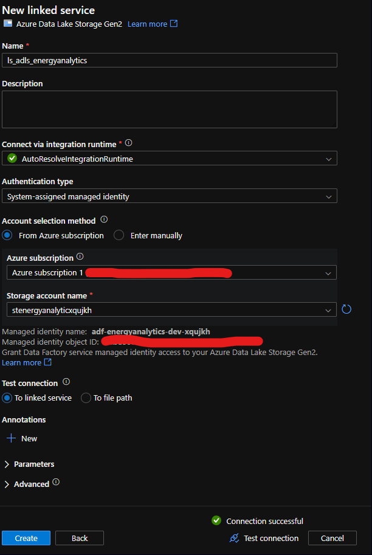

Configure the linked service for the deployed `<adls-account>` and verify the connection.

## 4.2 Azure Function Linked Service

Create:

```text
ls_azure_function_noaa
```

In ADF Studio:

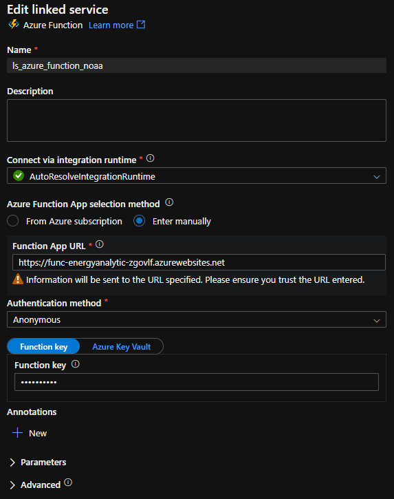

The Function key is obtained from the Function App in Azure and supplied to the linked service. It is not hard-coded in Function source code.

This linked service is used by the NOAA Azure Function activity.

## 4.3 NOAA Pipeline

Create:

```text
pl_process_noaa
```

Flow:

```text
Azure Function activity
    ↓
ls_azure_function_noaa
    ↓
process-noaa
    ↓
curated/climate/climate_monthly.parquet
```

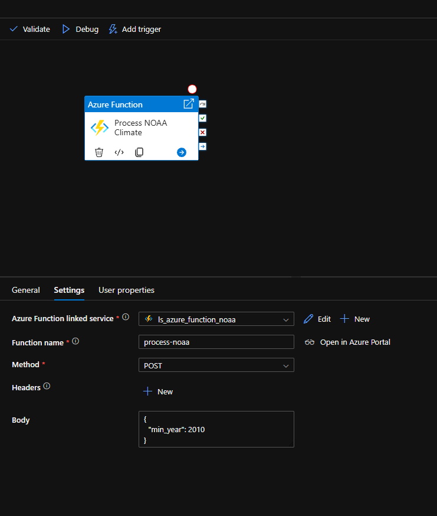

Debug the pipeline and verify the curated NOAA output.

## 4.4 EIA Retail Pipeline

Create:

```text
pl_process_eia_retail
```

Use a Web activity:

```text
Method:
POST

URL:
https://<function-app-name>.azurewebsites.net/api/process-eia-retail?code=<FUNCTION_KEY>

Body:
{"min_year": 2010}

Authentication:
None
```

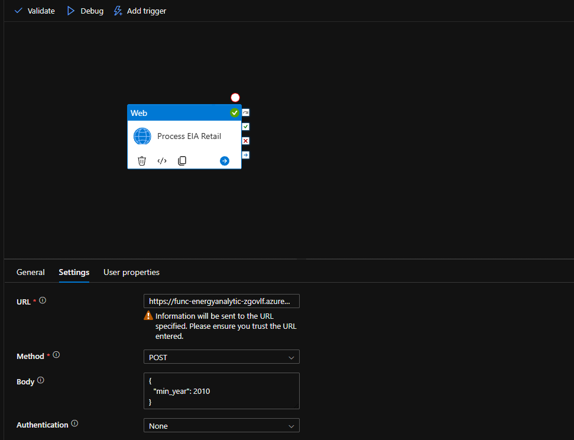

For this configuration, `Authentication: None` is intentional because the Function key is supplied through the `code` query parameter.

Obtain the Function/host key from:

```text
Azure Portal
→ Function App
→ App keys / Host keys
```

Copy the key into the `?code=` portion of the Web activity URL.

Run the pipeline and verify:

```text
curated/eia/retail/retail_monthly.parquet
```

## 4.5 EIA Generation Pipeline

Create:

```text
pl_process_eia_generation
```

Use a Web activity:

```text
Method:
POST

URL:
https://<function-app-name>.azurewebsites.net/api/process-eia-generation?code=<FUNCTION_KEY>

Body:
{"min_year": 2010}

Authentication:
None
```

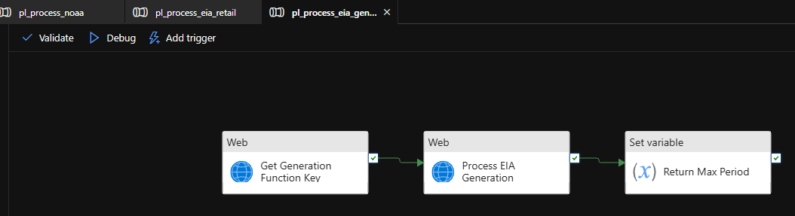

Use the Function key from the Function App and place it in the `?code=` query parameter.

Verify:

```text
curated/eia/generation/generation_monthly.parquet
```

At this stage:

```text
NOAA ──────────> ADF ──> Azure Function ──> curated/climate
EIA Retail ────> ADF ──> Azure Function ──> curated/eia/retail
EIA Generation → ADF ──> Azure Function ──> curated/eia/generation
```

---

# 5. SQL Deployment Structure

The Synapse warehouse is implemented through ordered SQL scripts. For a clean deployment, execute them in numeric order as the corresponding stages are reached:

```text
sql/
├── 00_setup_external_access.sql
├── 01_create_staging.sql
├── 02_load_staging.sql
├── 03_create_dimensions.sql
├── 04_create_facts.sql
├── 05_load_dimensions.sql
├── 06_load_facts.sql
├── 07_validation.sql
├── 08_create_analytical_views.sql
├── 09_incremental_load_retail.sql
├── 10_incremental_load_generation.sql
├── 11_incremental_load_climate.sql
├── 12_incremental_orchestration.sql
├── 13_grant_adf_permissions.sql
├── 14_create_kpi_views.sql
└── 15_grant_powerbi_permissions.sql
```

The sections below describe what each group of scripts implements and when it is applied.

---

# 6. Synapse External Access and Warehouse Setup

The curated Parquet datasets are loaded into an Azure Synapse Dedicated SQL Pool.

Schemas:

```text
stg
dw
```

## 6.1 Synapse → ADLS Security

Implemented by `sql/00_setup_external_access.sql`.

Use the Synapse workspace Managed Identity rather than embedding a storage credential in SQL.

Configuration flow:

```text
Synapse workspace Managed Identity
    ↓
grant access to <adls-account>
    ↓
Dedicated SQL Pool
    ↓
database-scoped credential
IDENTITY = 'Managed Identity'
    ↓
external data source
    ↓
ADLS /curated
```

Create the database master key securely in Synapse.

Then create the Managed Identity credential and curated external data source.

Conceptually:

```sql
CREATE MASTER KEY
ENCRYPTION BY PASSWORD = '<SECURE_PASSWORD>';

CREATE DATABASE SCOPED CREDENTIAL SynapseManagedIdentity
WITH IDENTITY = 'Managed Identity';

CREATE EXTERNAL DATA SOURCE CuratedData
WITH
(
    LOCATION =
    'abfss://curated@<adls-account>.dfs.core.windows.net',
    CREDENTIAL = SynapseManagedIdentity
);
```

The password placeholder must be replaced securely when executing the setup.

## 6.2 Staging Tables

Created by `sql/01_create_staging.sql` and initially loaded by `sql/02_load_staging.sql`.

Create:

```text
stg.ClimateMonthly
stg.RetailMonthly
stg.GenerationMonthly
```

Load the curated Parquet datasets with `COPY INTO`.

Validated staging counts:

```text
Climate       10,000
Retail        50,490
Generation   392,595
```

## 6.3 Dimensions

Created and loaded by `sql/03_create_dimensions.sql` and `sql/05_load_dimensions.sql`.

Create:

```text
dw.DimDate
dw.DimState
dw.DimSector
dw.DimEnergySource
dw.DimProducerType
```

Small dimensions use replicated distribution.

Synapse primary keys are declared `NOT ENFORCED`, so uniqueness is checked explicitly during validation.

`DC` is represented as `District of Columbia`; NOAA does not provide DC climate observations.

## 6.4 Facts

Created and initially loaded by `sql/04_create_facts.sql` and `sql/06_load_facts.sql`.

Create:

```text
dw.FactClimate
dw.FactRetailElectricity
dw.FactElectricityGeneration
```

Grains:

| Fact | Grain |
|---|---|
| `FactClimate` | State × Month |
| `FactRetailElectricity` | State × Month × Sector |
| `FactElectricityGeneration` | State × Month × Producer Type × Energy Source |

The current fact design uses `ROUND_ROBIN + HEAP`, appropriate for the project scale.

Facts with different grains are not joined row-for-row. Combined analysis aggregates each fact independently to a compatible grain such as:

```text
State × Month
```

---

# 7. Incremental Warehouse Loading

The incremental implementation is contained in `sql/09_incremental_load_retail.sql`, `sql/10_incremental_load_generation.sql`, `sql/11_incremental_load_climate.sql`, and `sql/12_incremental_orchestration.sql`.

The initial full-load SQL remains available for initialization and recovery.

Incremental procedures:

```text
dw.usp_LoadRetailIncremental
dw.usp_LoadGenerationIncremental
dw.usp_LoadClimateIncremental
dw.usp_LoadWarehouseIncremental
dw.usp_RefreshStaging
```

Each dataset loader:

1. reads the maximum fact `date_key` as its watermark;
2. inserts missing `DimDate` values;
3. considers staging rows from the latest loaded month onward;
4. resolves dimension surrogate keys;
5. inserts only rows missing at the target fact grain using `NOT EXISTS`.

This produces an insert-only, idempotent warehouse load.

Staging refresh:

```text
TRUNCATE staging
        ↓
COPY INTO
        ↓
complete curated Parquet snapshot
```

Warehouse increment:

```text
staging
   ↓
watermark + NOT EXISTS
   ↓
new fact rows only
```

Historical source corrections can use the preserved full-refresh path.

---

# 8. Analytical and KPI Views

Core analytical views are created by `sql/08_create_analytical_views.sql`:


```text
dw.vw_RetailDetail
dw.vw_RetailTotal
dw.vw_GenerationDetail
dw.vw_GenerationTotal
dw.vw_ClimateMonthly
dw.vw_DemandWeather
dw.vw_RetailGeneration
```

Important rules:

```text
vw_RetailDetail
→ excludes Retail Total

vw_RetailTotal
→ contains only Retail Total

vw_GenerationDetail
→ excludes producer/source totals

vw_GenerationTotal
→ Total Electric Power Industry + Total energy source

cross-fact views
→ compatible State × Month grain
```

Reporting/KPI views are created by `sql/14_create_kpi_views.sql`:


```text
dw.vw_EnergySourceClassification
dw.vw_GenerationMix
dw.vw_GenerationCategoryMonthly
dw.vw_GenerationShare
dw.vw_RetailKPI
dw.vw_SectorKPI
dw.vw_WeatherDemandKPI
dw.vw_RetailGenerationKPI
```

Generation categories:

```text
Renewable
Fossil
Nuclear
Storage
Other
```

Aggregated electricity price uses a weighted calculation:

```text
SUM(revenue_thousand_dollars) * 100
/
SUM(sales_mwh)
```

`generation_minus_retail_mwh` is presented as:

```text
Generation − Retail Sales
```

It is not interpreted as actual grid imports or exports.

---

# 9. Warehouse Validation

Validation is implemented in `sql/07_validation.sql` and completed before connecting the reporting layer.

Checks include:

- staging row counts;
- source/warehouse period ranges;
- staging business-key duplicates;
- dimension uniqueness;
- fact-grain duplicates;
- staging-to-fact count reconciliation.

Final fact counts:

```text
FactRetailElectricity       50,490
FactElectricityGeneration  392,595
FactClimate                 10,000
```

All duplicate/grain exception queries returned:

```text
0 rows
```

Incremental behavior was also tested by removing the latest Retail month and executing:

```text
dw.usp_LoadRetailIncremental
```

The missing month was restored, the fact returned to 50,490 rows, and duplicate validation remained clean.

Repeated execution of all incremental procedures produced no duplicate rows.

---

# 10. ADF → Synapse Integration and Security

After the warehouse procedures are ready, connect ADF to the Dedicated SQL Pool.

## 9.1 Synapse Linked Service

Create:

```text
ls_synapse_energydw
```

Configure:

```text
Server:
<synapse-workspace>.sql.azuresynapse.net

Database:
<sql-pool>

Authentication:
System-assigned Managed Identity
```

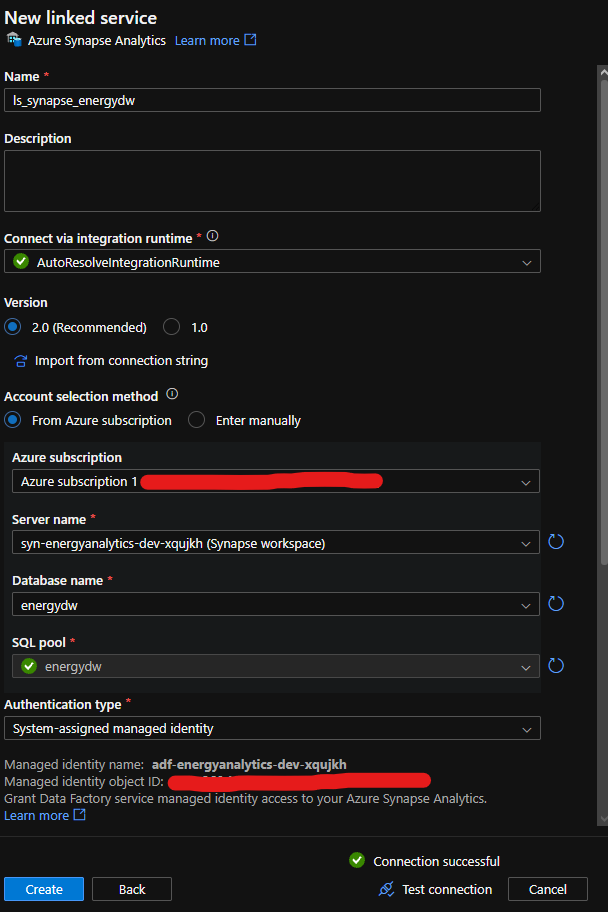

The identity is the system-assigned Managed Identity of `<adf-name>`.

Configure Synapse networking to allow Azure services/resources to access the workspace, then test the linked service.

## 9.2 ADF Database Principal

In the Dedicated SQL Pool, create an external database user for the ADF Managed Identity.

Grant only the permissions required for:

- execution of the warehouse procedures;
- staging refresh;
- `COPY INTO`;
- staging reads;
- watermark/dimension reads;
- incremental inserts.

The project does not require ADF to have:

```text
db_owner
CONTROL
UPDATE
DELETE
```

The ADF database principal and its least-privilege grants are implemented in `sql/13_grant_adf_permissions.sql`.

## 9.3 Master Incremental Pipeline

Create:

```text
pl_energy_market_incremental
```

Execute the three source pipelines in parallel:

```text
                 ┌─ Process NOAA ────────────┐
                 │                            │
Start ───────────┼─ Process EIA Retail ──────┼─> Refresh Synapse Staging
                 │                            │            ↓
                 └─ Process EIA Generation ──┘    Load Warehouse Incrementally
```

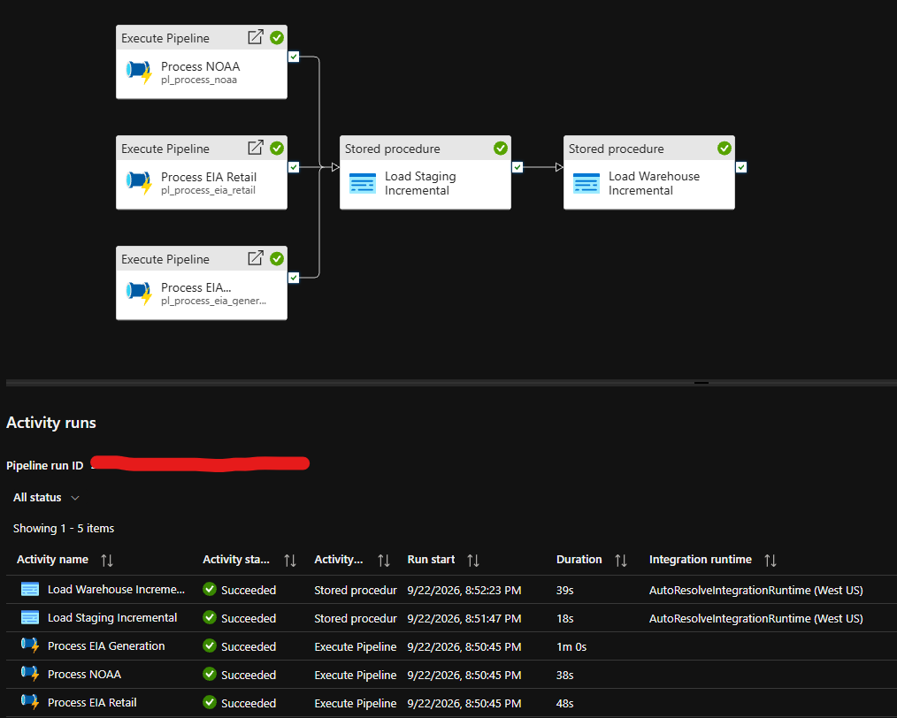

All three source pipeline activities use **Success** dependencies into the staging refresh.

First Stored Procedure activity:

```text
Name:
Refresh Synapse Staging

Linked service:
ls_synapse_energydw

Procedure:
dw.usp_RefreshStaging
```

Second Stored Procedure activity:

```text
Name:
Load Warehouse Incrementally

Linked service:
ls_synapse_energydw

Procedure:
dw.usp_LoadWarehouseIncremental
```

Run the complete master pipeline and rerun warehouse validation.

The end-to-end execution completed with the expected warehouse counts and zero duplicate/grain exceptions.

---

# 11. Power BI Read-only Access

Reporting access is configured before building the Power BI model.

The Synapse administrator is used only to provision the dedicated reporting login/user and permissions.

The Power BI report itself uses:

```text
powerbi_reader
```

## 11.1 Create the Reporting Login

Use the Synapse administrator only for provisioning the reporting login.

In the Synapse `master` database:

```sql
CREATE LOGIN powerbi_reader
WITH PASSWORD = '<STRONG_PASSWORD>';
```

Supply the password securely when executing the command. The password is not stored in the repository.

## 11.2 Create the Read-only Database User and Grants

After the login exists, switch to `<sql-pool>` and run:

```text
sql/15_grant_powerbi_permissions.sql
```

The script creates `powerbi_reader` as a database user if required and grants `SELECT` only to:

```text
dw.DimDate
dw.DimState
dw.vw_RetailKPI
dw.vw_SectorKPI
dw.vw_GenerationMix
dw.vw_GenerationShare
dw.vw_WeatherDemandKPI
dw.vw_RetailGenerationKPI
```

Final reporting-access flow:

```text
Synapse administrator
        ↓
CREATE LOGIN powerbi_reader in master
        ↓
15_grant_powerbi_permissions.sql in <sql-pool>
        ↓
read-only database user + object-level SELECT
        ↓
Power BI Desktop connects as powerbi_reader
```

The Power BI model and dashboard are developed using the read-only reporting account rather than the Synapse administrator.

---

# 12. Power BI Connection and Model

Connect Power BI Desktop to:

```text
Server:
<synapse-workspace>.sql.azuresynapse.net

Database:
<sql-pool>

Authentication:
Database / SQL authentication

User:
powerbi_reader
```

Import:

```text
dw.DimDate
dw.DimState
dw.vw_RetailKPI
dw.vw_SectorKPI
dw.vw_GenerationMix
dw.vw_GenerationShare
dw.vw_WeatherDemandKPI
dw.vw_RetailGenerationKPI
```

For each of the six reporting views create:

```text
DimState[state_code]
1 → *

DimDate[full_date]
1 → *
```

Relationship settings:

```text
Active: Yes
Cross-filter direction: Single
```

No direct view-to-view relationships are required.

Total relationships:

```text
12
```

---

# 13. Power BI Measures

## Retail

```DAX
Total Retail Sales =
SUM('dw vw_RetailKPI'[sales_mwh])
```

```DAX
Total Revenue =
SUM('dw vw_RetailKPI'[revenue_thousand_dollars]) * 1000
```

```DAX
Average Electricity Price =
DIVIDE(
    SUM('dw vw_RetailKPI'[revenue_thousand_dollars]) * 100,
    SUM('dw vw_RetailKPI'[sales_mwh])
)
```

```DAX
Customers Latest Month =
VAR LatestMonth =
    MAX('dw vw_RetailKPI'[full_date])
RETURN
    CALCULATE(
        SUM('dw vw_RetailKPI'[customer_count]),
        KEEPFILTERS('dw vw_RetailKPI'[full_date] = LatestMonth)
    )
```

```DAX
Retail Sales Previous Year =
SUM('dw vw_RetailKPI'[sales_mwh_previous_year])
```

```DAX
Retail Sales YoY % =
DIVIDE(
    [Total Retail Sales] - [Retail Sales Previous Year],
    [Retail Sales Previous Year]
)
```

## Generation

```DAX
Total Generation =
SUM('dw vw_GenerationMix'[generation_mwh])
```

```DAX
Renewable Generation =
CALCULATE(
    [Total Generation],
    'dw vw_GenerationMix'[energy_category] = "Renewable"
)
```

Fossil and Nuclear generation use the same category-filter pattern.

```DAX
Renewable Share % =
DIVIDE(
    [Renewable Generation],
    [Total Generation]
)
```

Fossil and Nuclear shares use the same pattern.

## Retail vs Generation

```DAX
Generation Surplus / Deficit =
SUM(
    'dw vw_RetailGenerationKPI'[generation_minus_retail_mwh]
)
```

Display it as:

```text
Generation − Retail Sales (MWh)
```

## Sector

```DAX
Sector Revenue =
SUM('dw vw_SectorKPI'[revenue_thousand_dollars]) * 1000
```

```DAX
Sector Average Price =
DIVIDE(
    SUM('dw vw_SectorKPI'[revenue_thousand_dollars]) * 100,
    SUM('dw vw_SectorKPI'[sales_mwh])
)
```

---

# 14. Power BI Dashboard

The final report contains five pages.

The default reporting period uses complete years through **2025**. The 2026 source data is partial/YTD.

## 14.1 Executive Overview

Cards:

- Total Retail Sales (MWh)
- Total Revenue ($)
- Average Price (¢/kWh)
- Customers (Latest Month)

Charts:

- Average Electricity Price Trend (¢/kWh)
- Retail Sales vs Electricity Generation (MWh)
- Electricity Generation by Category (MWh)

A redundant standalone Retail Sales Trend is intentionally omitted because the retail-sales series is already visible in the Retail vs Generation comparison.

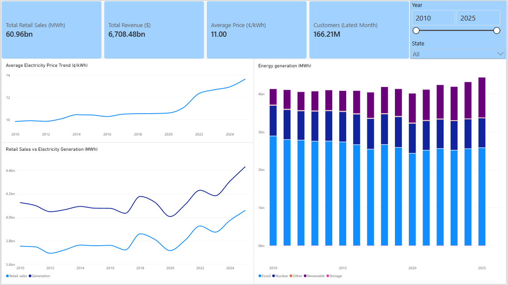

## 14.2 State Analysis

Cards:

- Retail Sales (MWh)
- Average Price (¢/kWh)
- Total Generation (MWh)
- Generation − Retail Sales (MWh)

Charts:

- Retail Sales by State
- Average Price by State
- Generation − Retail Sales by State
- Price vs Retail Sales by State

The page is designed primarily for cross-state comparison, so an all-state view is a useful default.

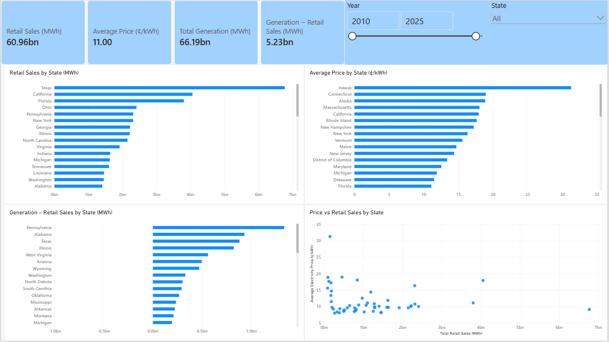

## 14.3 Sector Analysis

Charts:

- Revenue by Sector ($)
- Retail Sales by Sector (MWh)
- Average Electricity Price by Sector (¢/kWh)
- Sector Sales Trend (MWh)

Sector electricity price uses the weighted price measure rather than summing or simply averaging source price values.

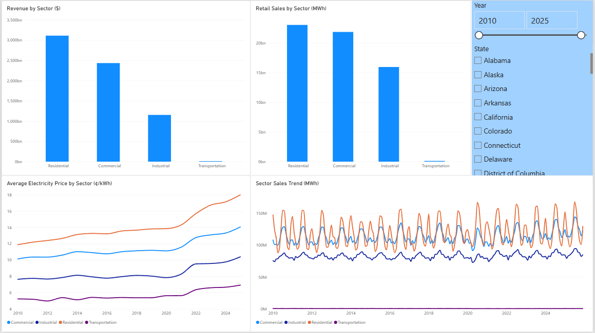

## 14.4 Generation Mix

Cards:

- Total Generation
- Fossil Share
- Nuclear Share
- Renewable Share

Charts:

- Generation Category Trend
- Generation by Energy Source
- Energy Share Trends
- Generation by Category

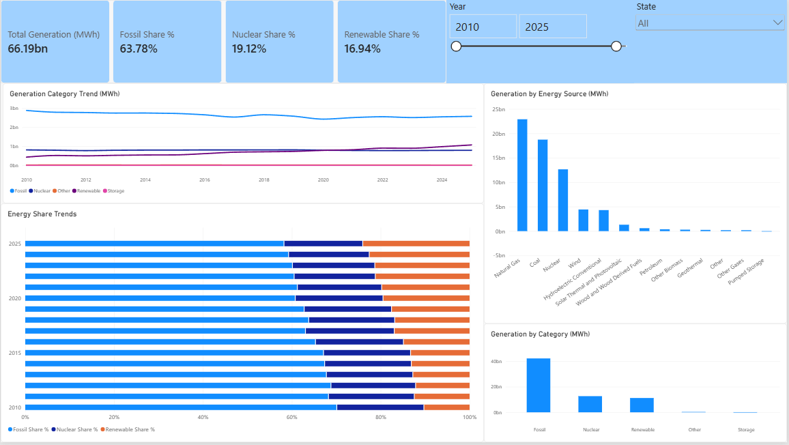

## 14.5 Weather & Demand

Cards:

- Average Temperature (°F)
- Total Retail Sales (MWh)
- Avg Monthly CDD
- Avg Monthly HDD

Charts:

- Temperature vs Retail Sales
- CDD vs Retail Sales
- HDD vs Retail Sales
- Quarterly Weather & Demand Trend

CDD and HDD are degree-day indicators. The summary cards use average monthly CDD/HDD values.

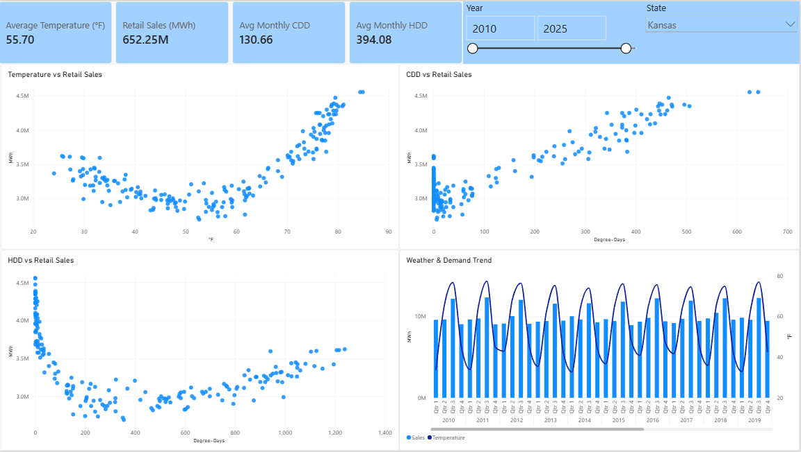

---

# 15. Final End-to-End Flow

```text
Original EIA / NOAA files
        ↓
ADLS /raw
        ↓
ADF source pipelines
        ↓
Azure Functions
        ↓
validated curated Parquet
        ↓
ADLS /curated
        ↓
Synapse staging refresh
        ↓
incremental warehouse procedures
        ↓
dimensions + facts
        ↓
warehouse validation
        ↓
analytical/KPI views
        ↓
read-only Power BI user
        ↓
Power BI semantic model
        ↓
five-page dashboard
```

---

# 16. Key Engineering Concepts

- Azure infrastructure as code with Terraform
- batch orchestration with Azure Data Factory
- Python/Pandas transformations with Azure Functions
- GitHub Actions Function deployment
- ADLS raw and curated data layers
- Parquet-based data interchange
- dimensional warehouse modeling
- explicit fact-grain management
- prevention of double counting from source totals
- watermark-based idempotent incremental loading
- staging refresh with `COPY INTO`
- stored-procedure orchestration
- Managed Identity service-to-service authentication
- least-privilege database access
- dedicated read-only reporting access
- analytical/KPI views in T-SQL
- Power BI semantic modeling and DAX
- end-to-end data validation and reconciliation
- cost control through pausing Synapse compute when unused
